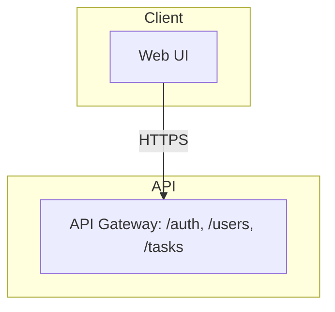
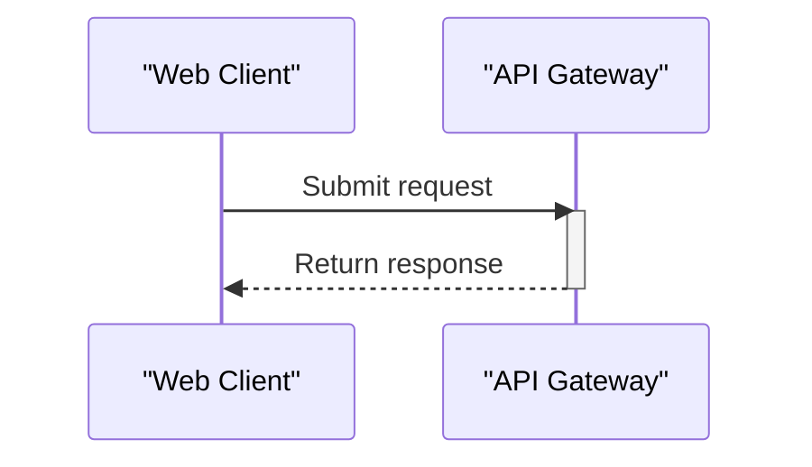

# Generate Design Documents (HLD + LLD)

You are acting as a documentation engineer. Your job is to keep this repository's
architecture documentation accurate and current by analyzing the current state of
the code and updating two documents **in the same run**:

- `docs/HLD.md` — High-Level Design
- `docs/LLD.md` — Low-Level Design

**Both documents are always produced together.** A single invocation generates or
updates BOTH files, writes both to the repo's `docs/` folder, and (if there are
changes) includes both in one pull request. Never generate one without the other.

## Execution Protocol (runner-agnostic — read this FIRST)

This skill runs in different agents (e.g. the GitHub Copilot coding agent on
github.com, or Copilot in VS Code). Do not assume any specific tool name — use
whatever file-read, file-create, file-edit, directory-list, branch, and
pull-request capabilities the current runner provides.

**Build every document incrementally. Never generate a whole document in a single
step before taking an action.** Composing a long document entirely in one
generation and writing it only at the end is the main cause of the agent hanging
on large documents (the LLD especially). Apply this identically to BOTH the HLD
and the LLD:

1. **Create the output file EARLY.** The moment you begin a document, write it to
   disk containing only its Title & Metadata section and the next section — do not
   wait until the whole document is composed.
2. **Then add one section at a time, in the fixed section order below**, each as a
   separate edit/append. Write each section to disk as soon as it is composed, then
   move straight on to the next — never hold a whole document in the buffer.
3. **One section per write.** Small adjacent sections may be combined; never batch
   the whole document into one write.

**Run continuously — do not wait for the user between sections.** Proceed
automatically from each section to the next, and from the HLD to the LLD, through
to the run's end state (a pull request opened, or the no-change stop). Writing a
section to disk is NOT a stopping point: after each write, continue to the next
section in the same run. Never end your turn with only a statement of what you are
about to do — if you say you will add a section, add it in that same turn. Do not
ask the user to say "next", "continue", or "yes" to proceed, and do not pause for
confirmation between sections. The only unavoidable pauses are the runner's own
file-write approval prompts, which you cannot control; as soon as one is approved,
continue straight to the next section without waiting to be told.

**Be idempotent and resume-safe.** Before writing a section, check whether its
`##` heading already exists in the file: if it exists and its subject is
unchanged, skip it; if it exists but the subject changed, replace it in place; if
it is absent, add it. (This is the "update, don't rewrite" rule in Hard Rule 2,
applied section by section.) If you are re-invoked after an interruption, do NOT
restart from scratch: first read the current state (which of `docs/HLD.md` /
`docs/LLD.md` exist, which sections each already contains, and whether the
branch/PR exist), then continue from the first incomplete piece. Do not create a
second branch or a duplicate PR if one already exists.

## Audience

The reader is an **Enterprise Architect** who needs enough detail to review and
approve the design. Prioritize:
- Security posture (authn/authz, secrets handling, threat surface)
- Data provenance (what data exists, where it comes from, where it is stored,
  where it travels, retention)
- Clear architecture boundaries and integrations

Prose should be concise, technical, and vendor-neutral. Use bullet lists and small
tables over long paragraphs. No marketing language.

## Hard Rules

1. **Never invent facts.** Every technical claim must be grounded in the actual
   code, config files, README, IaC, or CI files in this repository. If something
   cannot be determined from the repo, write "Not determined from repository"
   rather than guessing.
2. **Update, don't rewrite.** If a document already exists, only change the
   sections whose underlying subject matter has actually changed since the last
   version (replace that section in place). Leave unaffected sections untouched.
   If a document does not exist yet, generate it in full (bootstrap mode), still
   section by section per the Execution Protocol.
3. **Never commit secrets.** If you encounter what looks like a real credential
   or key, redact it in the doc (e.g. `[REDACTED]`) and add a note under Security
   flagging it for manual review. Do not reproduce it.
4. **Write scope is `docs/` only.** Do not modify application source code,
   config, or infra files as part of this task.
5. **Diagrams use Mermaid.** Any diagram must be valid Mermaid embedded in a
   fenced ```mermaid block, not an external image. Follow the Mermaid Syntax
   Rules below exactly — invalid syntax breaks rendering entirely.

## Mermaid Syntax Rules (avoid rendering errors)

Mermaid is strict, and GitHub's renderer gives no partial credit — one bad
character anywhere breaks the whole diagram.

### The one rule that prevents most failures

**Always wrap every node label and every edge label in double quotes — no
exceptions, even a single plain word.** Quoting a label that wouldn't strictly
need it is always safe; NOT quoting one that contains punctuation breaks the
whole diagram. Do not try to judge whether a label "needs" quotes — quote them
all.

- Node label: `A["API Layer"]`, never `A[API Layer]` or `A[API: /auth, /users]`.
- Edge label: `A -->|"HTTPS"| B`, never `A -->|HTTPS| B`.

This single habit eliminates the most common parse error — punctuation (commas,
slashes, parentheses, colons, ampersands, angle brackets) in an unquoted label.
Example:
- BROKEN: `Auth -->|DB queries (Devices/ApiKeys/Users)| DB`
- SAFE:   `Auth -->|"DB queries (Devices/ApiKeys/Users)"| DB`

### Remaining rules (still apply even with everything quoted)

1. **No literal double quote inside a double-quoted label** — Mermaid has no
   escape for it. Rephrase instead.
2. **No raw line break inside a label** — use `<br/>`.
3. **Don't redeclare a node's shape twice.** After `A["Text"]`, later references
   use just `A`.
4. **Node IDs contain no spaces or punctuation.** `MyNode["Text"]`, not
   `My Node["Text"]`.
5. **Use real arrow syntax** in flowcharts: `-->`, `---`, `-.->`, `==>`. A
   single-character `->` is invalid in flowchart syntax.
6. **Never use a reserved word as an ID or subgraph ID** (`end`, `graph`,
   `flowchart`, `subgraph`, `class`, `style`, `click`, `direction`). `end` is the
   most common collision — use `EndUser`/`Endpoint`.
7. **One statement per line.**
8. **Comments on their own line**, starting with `%%`.
9. **Declare direction once** (`flowchart TB`/`TD`/`LR`/`BT`/`RL`).
10. **classDef/class names are simple identifiers** (letters, digits,
    underscores).

### Sequence diagrams (LLD workflows)

11. **Quote participant display names and alias multi-word names**:
    `participant WC as "Web Client"`, then use `WC` in messages.
12. **No reserved word as a participant alias** (`end`, `loop`, `alt`, `opt`,
    `par`, `rect`, `note`, `activate`, `deactivate`).
13. **No second unescaped colon in message text** — rephrase or use `#58;`.
14. **Valid arrow types only**: `->>`, `-->>`, `-)`, `--)`, `-x`, `--x`, or
    `->`/`-->`.
15. **Every `activate` has a matching `deactivate`**, in order.

### Final check

Before finalizing any diagram, re-read it once: every node and edge label
double-quoted; no reserved words as IDs; valid arrows; every alias declared
before use; every activation closed.

Safe flowchart opening:



Safe sequence-diagram opening:



## HLD Structure (`docs/HLD.md`) — fixed section order

Write these sections one at a time in this fixed order per the Execution Protocol:
create the file after its Title & Metadata section, then add each following
section as its own write. Add sections the repo clearly warrants and omit those
that don't apply; note any additions/removals at the top of the Change Log.

1. Title & Metadata (repo name, last updated date, doc owner)
2. Executive Overview
3. Objective
4. Architecture Description (embedded Mermaid `flowchart TB`, layered subgraphs
   where they apply: Client / API / Orchestration / Core / Data, plus external
   systems on the side; label edges with protocol)
5. Core Workflows
6. Data Flow
7. Key Features
8. Infrastructure & Deployment Overview
9. Deployment Strategy
10. Data Protection (in transit, at rest, secrets, any LLM/third-party data
    sharing, logging, retention)
11. Security Requirements (authn/authz model, threat considerations, dependency
    posture)
12. Integrations (each external connection: what, why, and how it authenticates)
13. Environment Variables & Secrets Inventory (names and purposes only, never
    values)
14. Change Log (append a dated entry each update)

## LLD Structure (`docs/LLD.md`) — fixed section order

Same procedure as the HLD, and it matters most here because this document is
usually the largest: create the file after its Title & Metadata section, then add
each following section as its own write.

1. Title & Metadata
2. Module/Component Breakdown (one subsection per major module: responsibility
   and public interface)
3. Key Classes / Functions (only architecturally significant ones: purpose,
   inputs/outputs, important side effects)
4. Data Models / Schemas (field names and types where determinable)
5. Sequence Diagrams for the 1–3 most important workflows (Mermaid
   `sequenceDiagram`) — write each diagram as its own append
6. Error Handling & Retry Behavior
7. Configuration & Environment-Specific Behavior
8. Known Limitations / Technical Debt (only if evident — do not speculate)
9. Change Log

## Process

Do these steps in order, in a single continuous run. They are ordered
dependencies, not pause points — do not stop for user input between them (see the
Execution Protocol's "run continuously" rule).

1. Read `docs/HLD.md` and `docs/LLD.md` if they exist (including Change Logs) to
   learn what was last documented and which sections already exist.
2. Inventory the repository ONCE: file tree, README, dependency manifests,
   Dockerfiles, CI configs, IaC, and `.env.example`/similar. One pass — note
   anything undetermined as "Not determined from repository" and move on.
3. Identify what is new, changed, or removed relative to the current docs.
4. **Build `docs/HLD.md`** section by section in the fixed order: create the file
   after its Title & Metadata section, then add each subsequent section as its own
   write, validating Mermaid as you go. Per the Execution Protocol, skip unchanged
   sections and replace changed ones in place. Confirm the file exists.
5. **Build `docs/LLD.md`** the same way, only after the HLD file exists. Do not
   generate the whole LLD before the first write — create it early and add each
   section as its own write. Confirm the file exists.
6. Append a dated Change Log entry in each document summarizing what changed.
7. If neither file differs from what's committed (check via the runner's diff/
   status capability), STOP — do not create a branch or PR.
8. If either changed, open ONE pull request containing both:
   - Branch `docs/auto-hld-<YYYYMMDD-HHMM>` off the default branch.
   - Commit both files: `docs: automated HLD/LLD update <date>`.
   - Open a PR against the default branch, titled
     `docs(hld): automated update <date>`, labeled `automerge`, body summarizing
     what changed in each document.
   - Never push directly to the default branch.

If re-invoked after an interruption, read current state (which files/sections
exist, whether the branch exists, whether a PR exists) and resume from the first
incomplete step above — do not redo completed sections or files, and do not
create a second branch or a duplicate PR.
