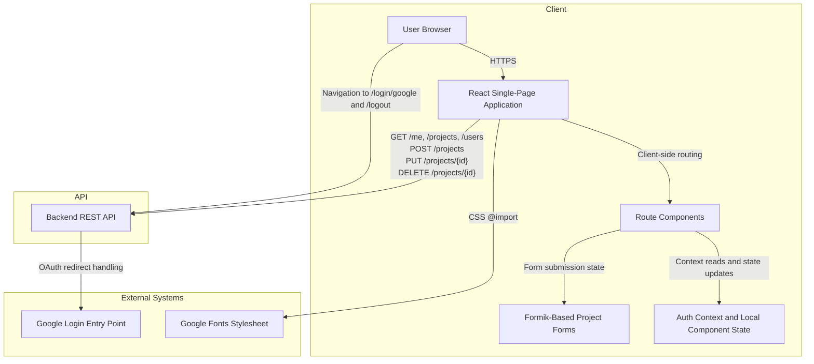

# High-Level Design: hackbca-example-frontend

## Title & Metadata

| Metadata | Value |
| --- | --- |
| Repository | `nikithajoshy26/hackbca-example-frontend` |
| Last Updated | 2026-09-17 |
| Doc Owner | Not determined from repository |

## Executive Overview

- This repository delivers a browser-based React single-page application for a hackathon event site with project discovery and project submission/editing flows.
- The UI is built with React 17, React Router 6, Formik, Font Awesome, and Tailwind CSS configured through CRACO (`package.json`, `craco.config.js`, `tailwind.config.js`).
- Runtime data is retrieved from, and mutations are sent to, an external HTTP API selected by `REACT_APP_API_URL` or defaulting to `http://localhost:8000` (`src/utils.js`).
- Authentication state is derived by requesting `/me` with browser cookies and then reused through a React context (`src/App.js`).

## Objective

- Provide a minimal frontend prototype for hackBCA participants to:
  - view a landing page and project catalog,
  - inspect project details,
  - sign in through a Google-backed backend login flow, and
  - create, update, or delete projects when authenticated (`src/pages/Home.js`, `src/pages/Projects.js`, `src/pages/Project.js`, `src/pages/ProjectForm.js`).
- Keep deployment lightweight by compiling to static assets served separately from the API/backend (`README.md`, `package.json`).

## Architecture Description

## Core Workflows

### 1. Initial application load

1. `src/index.js` renders `App`.
2. `App` requests `GET /me` with `credentials: "include"` to determine whether a session cookie already maps to a user (`src/App.js`).
3. `Navbar`, `Home`, `Projects`, and project edit controls adapt their UI based on the `AuthContext` value.

### 2. Browse and inspect projects

1. The `/projects` route fetches `GET /projects` on mount and renders a grid of project summaries (`src/pages/Projects.js`).
2. Selecting a project name navigates to `/projects/:id`.
3. The project detail page fetches `GET /projects/{id}` and renders metadata, owners, optional GitHub URL, and optional external URL (`src/pages/Project.js`).

### 3. Authenticated project maintenance

1. Authenticated users can navigate to `/projects/new` or `/projects/:id/edit`.
2. The form loads candidate owners from `GET /users`, validates duplicate owner selection locally, and serializes `date_proposed` and `time` values to ISO strings before submission (`src/pages/ProjectForm.js`).
3. Create uses `POST /projects`, update uses `PUT /projects/{id}`, and delete uses `DELETE /projects/{id}` from the projects list modal (`src/pages/ProjectForm.js`, `src/pages/Projects.js`).

## Data Flow

| Data | Source | Consumed By | Direction | Notes |
| --- | --- | --- | --- | --- |
| Current user | `GET /me` response | `AuthContext`, `Navbar`, `Home`, project ownership checks | Backend API to browser memory | No persistent client-side storage is implemented in this repo. |
| Project collection | `GET /projects` response | `Projects` route and delete filtering logic | Backend API to browser memory | Owners are displayed as joined email strings. |
| Individual project | `GET /projects/{id}` response | `Project` route and edit-form bootstrap | Backend API to browser memory | `404` and `422` are mapped to `Project not found`. |
| User directory | `GET /users` response | Project owner dropdowns | Backend API to browser memory | Used only when rendering project forms. |
| Project mutation payloads | Formik form state plus authenticated user id | `POST /projects`, `PUT /projects/{id}` | Browser memory to backend API | `prepareInput` converts date/time inputs into ISO strings and appends the current user id. |
| Session cookies | Not determined from repository | Browser requests with `credentials: "include"` | Browser to backend API | Cookie structure, lifetime, and storage policy are not determined from repository. |

## Key Features

- Client-side routing for home, list, detail, create, edit, and fallback routes (`src/App.js`).
- Shared authentication context used to tailor login links, owner-only edit/delete affordances, and the home-page sign-in prompt (`src/App.js`, `src/Navbar.js`, `src/pages/Home.js`, `src/pages/Projects.js`, `src/pages/Project.js`).
- Project list view with project name, owner emails, formatted time, type label, and modal-based deletion confirmation (`src/pages/Projects.js`, `src/formatting.js`, `src/modals.js`, `src/types.js`).
- Project detail view with formatted schedule data plus optional GitHub and external links (`src/pages/Project.js`).
- Project create/update forms with local validation, dynamic owner arrays, and type selection (`src/pages/ProjectForm.js`, `src/types.js`).
- Tailwind-based branding through shared utility classes and custom theme colors (`src/index.css`, `tailwind.config.js`).

## Infrastructure & Deployment Overview

- Build and local development use CRACO as a wrapper around Create React App:
  - `npm start` → `craco start`
  - `npm run build` → `craco build`
  - `npm test` → `craco test`
  (`package.json`)
- PostCSS is extended with Tailwind CSS and Autoprefixer through `craco.config.js`.
- Production guidance in `README.md` builds static assets with `REACT_APP_API_URL=https://example.com npm run build` and then serves the generated `build/` directory with `serve`.
- No Dockerfile, infrastructure-as-code templates, `.env.example`, or repository-defined GitHub Actions workflow files were found in the repository inventory.

## Deployment Strategy

- Development deployment is a local React dev server started with `npm start` (`README.md`, `package.json`).
- Production deployment is a static-asset publish flow:
  1. inject the backend base URL at build time through `REACT_APP_API_URL`,
  2. run `npm run build`,
  3. host the generated `build/` assets behind a static web server (`README.md`).
- Backend release orchestration, CDN configuration, TLS termination location, and rollback strategy are not determined from repository.

## Data Protection

- **In transit:** The production example in `README.md` uses an `https://` API URL, indicating intended TLS-protected browser-to-API traffic in production.
- **At rest:** No client-side persistence layer such as Local Storage, IndexedDB, or service-worker caching is implemented in this repository; browser memory is the only directly observable storage location.
- **Secrets handling:** The only environment variable referenced by the frontend is `REACT_APP_API_URL`, which is configuration rather than a secret (`src/utils.js`). No secrets were found in tracked repository files.
- **Third-party data sharing:** The application requests a Google Fonts stylesheet from `fonts.googleapis.com` and initiates authentication by navigating to backend login endpoints that reference Google sign-in flows (`src/index.css`, `src/Navbar.js`, `src/pages/Home.js`).
- **Logging and telemetry:** `reportWebVitals` exists and can emit metrics only if a callback is supplied, but no analytics endpoint or callback wiring is configured in this repository (`src/index.js`, `src/reportWebVitals.js`).
- **Retention:** Cookie retention, backend retention, and server logging retention are not determined from repository.

## Security Requirements

- Treat the backend as the source of truth for authentication and authorization; the frontend only performs presentation-layer checks such as comparing owner emails before showing edit/delete controls (`src/pages/Projects.js`, `src/pages/Project.js`).
- Preserve secure cookie handling on all authenticated endpoints because the frontend relies on `credentials: "include"` for `/me`, project mutations, and user listing (`src/App.js`, `src/pages/ProjectForm.js`, `src/pages/Projects.js`).
- Require HTTPS in production to protect session cookies and API traffic; the repository's production example already points to an `https://` backend (`README.md`).
- Validate and sanitize all project and user data server-side because this frontend performs only limited client-side validation with Formik and renders backend-supplied content directly into JSX (`src/pages/ProjectForm.js`, `src/pages/Project.js`, `src/pages/Projects.js`).
- Dependency vulnerability posture is not determined from repository because no audit report, lockfile scan output, or repository security policy is included.

## Integrations

| Integration | Purpose | Interaction Pattern | Authentication |
| --- | --- | --- | --- |
| Backend REST API | Supplies user and project data and accepts CRUD mutations | Browser `fetch` calls plus browser navigation to login/logout endpoints | Session cookies via `credentials: "include"` for API calls; exact cookie mechanism not determined from repository |
| Google sign-in flow | Enables federated login through the backend | Browser follows `/login/google` links emitted by the frontend | Managed by the backend; exact OAuth parameters are not determined from repository |
| Google Fonts | Loads the `Fira Sans` font family used by the UI theme | CSS `@import` from `https://fonts.googleapis.com/...` | Public, unauthenticated request |

## Environment Variables & Secrets Inventory

| Name | Required | Purpose | Secret |
| --- | --- | --- | --- |
| `REACT_APP_API_URL` | No, because a default is coded | Selects the backend base URL used by login links and all observed API requests | No |

- No `.env.example`, `.env`, or other checked-in environment templates were found in the repository inventory.
- No hard-coded credentials, API keys, or tokens were found in the repository files reviewed for this document run.

## Change Log

- 2026-09-17: Initial HLD generated from the current repository state. Added architecture, workflow, deployment, security, integration, and environment inventory sections for the React frontend prototype.
