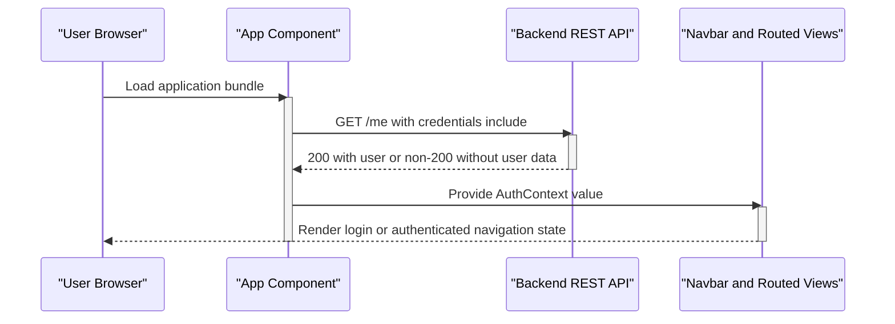
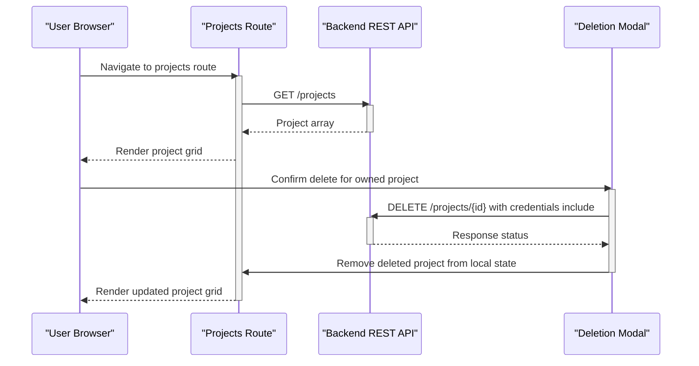
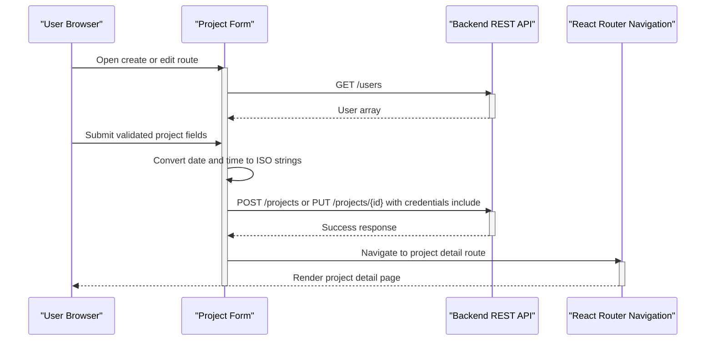

# Low-Level Design: hackbca-example-frontend

## Title & Metadata

| Metadata | Value |
| --- | --- |
| Repository | `nikithajoshy26/hackbca-example-frontend` |
| Last Updated | 2026-09-17 |
| Doc Owner | Not determined from repository |

## Module/Component Breakdown

### `src/index.js`

- **Responsibility:** Browser entry point that mounts the React tree and enables optional web-vitals reporting.
- **Public interface:** None; executes application bootstrap into the DOM element with id `root`.

### `src/App.js`

- **Responsibility:** Defines the top-level layout, initializes authentication context from `/me`, and maps URL paths to page components.
- **Public interface:** Default `App` component and exported `AuthContext`.

### `src/Navbar.js` and `src/Footer.js`

- **Responsibility:** Provide persistent page chrome around routed content.
- **Public interface:** `Navbar()` and `Footer()` functional components.

### `src/pages/Home.js`

- **Responsibility:** Renders the landing page and exposes a sign-in link when no authenticated user is present.
- **Public interface:** `Home()` route component.

### `src/pages/Projects.js`

- **Responsibility:** Fetches and renders the project collection, conditionally exposes create/edit/delete affordances, and hosts deletion confirmation state.
- **Public interface:** `Projects()` route component; internal `ProjectRow()` helper component.

### `src/pages/Project.js`

- **Responsibility:** Fetches and renders a single project and conditionally shows an edit action to owners.
- **Public interface:** `Project()` route component; internal `ProjectContent()` helper component.

### `src/pages/ProjectForm.js`

- **Responsibility:** Implements create and update flows, owner selection, client-side validation, request payload shaping, and navigation after successful mutation.
- **Public interface:** `NewProjectForm()` and `UpdateProjectForm()` route components; internal helpers `FormGroup()`, `FormSelect()`, `FormTextarea()`, `UserDropdown()`, `prepareInput()`, and `ProjectFormContent()`.

### Supporting utility modules

- `src/utils.js`: provides `getAPIURL()` for environment-aware backend URL resolution.
- `src/types.js`: provides project type lookup and label helpers.
- `src/formatting.js`: provides date/time presentation helpers.
- `src/modals.js`: wraps `react-overlays` `Modal` with repository-specific styling.
- `src/index.css`: imports the theme font and declares shared Tailwind-based utility classes.

## Key Classes / Functions

| Symbol | Location | Purpose | Inputs / Outputs | Important Side Effects |
| --- | --- | --- | --- | --- |
| `App` | `src/App.js` | Bootstraps routing and authentication state | No props observed; returns the routed application shell | Requests `GET /me`; updates `AuthContext` state |
| `AuthContext` | `src/App.js` | Shares authenticated user state across the component tree | Current user object or `null` | Controls conditional rendering across multiple routes |
| `Navbar` | `src/Navbar.js` | Builds route-aware login/logout navigation | No explicit props | Reads current path and authenticated user; emits backend login/logout links |
| `Projects` | `src/pages/Projects.js` | Lists projects and coordinates deletion | No explicit props | Requests `GET /projects`; updates local list state; issues `DELETE /projects/{id}` |
| `ProjectRow` | `src/pages/Projects.js` | Renders one project summary row | `project`, `onDelete` | Delegates delete intent back to parent |
| `Project` | `src/pages/Project.js` | Loads a project by route parameter | Reads `id` from URL params | Requests `GET /projects/{id}`; maps `404` and `422` to an error state |
| `ProjectContent` | `src/pages/Project.js` | Displays one project model | `project` | Reads `AuthContext` to show owner-only edit action |
| `ProjectFormContent` | `src/pages/ProjectForm.js` | Hosts shared form logic for create and update flows | `update`, `project` | Requests `GET /users`; posts or puts project payloads; navigates on success |
| `prepareInput` | `src/pages/ProjectForm.js` | Converts form values into backend payload format | Raw form fields plus `currentUser` | Creates ISO date/time strings and appends the current user id to the owners array |
| `getAPIURL` | `src/utils.js` | Resolves the backend base URL | None | Reads `process.env.REACT_APP_API_URL` |
| `getTypes` / `getTypeLabel` | `src/types.js` | Centralize allowed project type labels | Type keys in, arrays or labels out | None |
| `formatDateProposed` / `formatTime` | `src/formatting.js` | Convert `Date` objects into user-facing strings | `Date` in, localized string out | Locale-dependent formatting |

## Data Models / Schemas

### `User`

| Field | Type | Source | Notes |
| --- | --- | --- | --- |
| `id` | `string` | `src/typings.d.ts` | Used in owner lists and mutation payloads. |
| `email` | `string` | `src/typings.d.ts` | Used for display and owner comparison in the UI. |

### `ProjectType`

| Value | Label | Source |
| --- | --- | --- |
| `software` | `Software` | `src/types.js` |
| `hardware` | `Hardware` | `src/types.js` |

### `Project`

| Field | Type | Source | Notes |
| --- | --- | --- | --- |
| `name` | `string` | `src/typings.d.ts` | Project title shown in list and detail views. |
| `users` | `User[]` | `src/typings.d.ts` | Owner collection; current user id is appended during form submission. |
| `date_proposed` | `string` | `src/typings.d.ts` | Converted to and from ISO-style strings in the form flow. |
| `time` | `string` | `src/typings.d.ts` | Converted to and from ISO-style strings in the form flow. |
| `description` | `string \| undefined` | `src/typings.d.ts` | Optional long-form description. |
| `github` | `string \| undefined` | `src/typings.d.ts` | Optional GitHub URL shown on the detail page. |
| `url` | `string \| undefined` | `src/typings.d.ts` | Optional external URL shown on the detail page. |
| `type` | `ProjectType` | `src/typings.d.ts` | Enumerated through `getTypes()` for form selection. |

### Derived client-side payload shape

| Field | Construction | Notes |
| --- | --- | --- |
| `users` | `[...]selectedOwnerIds, currentUser.id` | Ensures the authenticated submitter is included in the outgoing project mutation payload. |
| `time` | `Date` generated from `HH:MM` input, then `toISOString()` | Uses UTC setters before serialization. |
| `date_proposed` | `Date` generated from `YYYY-MM-DD` input, then `toISOString()` | Uses UTC setters before serialization. |

## Sequence Diagrams

### Workflow 1: Application bootstrap and authentication context initialization

### Workflow 2: Project list retrieval and deletion

### Workflow 3: Project creation or update submission

## Error Handling & Retry Behavior

| Area | Observed Behavior | Retry Behavior |
| --- | --- | --- |
| Initial auth lookup | `App` performs `GET /me` without an explicit `try/catch` or documented fallback branch around request failure | No explicit retry logic |
| Project list | `Projects` catches fetch failures, clears the list to `[]`, and renders the thrown error message | No explicit retry logic |
| Project detail | `Project` catches fetch failures and maps `404` and `422` to `Project not found` | No explicit retry logic |
| User directory for forms | `ProjectFormContent` stores an error when `GET /users` fails and changes the dropdown placeholder text | No explicit retry logic |
| Create or update mutation | The code treats `response.status === 200` as success; all other observed statuses surface a generic description-field error and are logged with `console.error` | No explicit retry logic |
| Delete mutation | The delete handler issues `DELETE /projects/{id}` and immediately removes the row from local state without checking the response body | No explicit retry logic or rollback |

## Configuration & Environment-Specific Behavior

- `getAPIURL()` reads `process.env.REACT_APP_API_URL` and falls back to `http://localhost:8000`, so the backend target is environment-specific at build time (`src/utils.js`).
- Production instructions explicitly override `REACT_APP_API_URL` before `npm run build`, which means different deploy targets require separate frontend builds unless the hosting strategy injects environment data outside this repository (`README.md`).
- Tailwind theme colors, widths, and font defaults are configured in `tailwind.config.js`; Tailwind processing is enabled through `craco.config.js`.
- Route behavior is entirely client-side through `BrowserRouter`, so production hosting must serve the SPA entry point for deep links such as `/projects/new` and `/projects/:id` to work correctly. Server-side rewrite rules are not determined from repository.

## Known Limitations / Technical Debt

- Several components declare `useEffect(async () => { ... })`, which is a non-ideal React pattern and can complicate cleanup behavior in Strict Mode (`src/App.js`, `src/pages/Projects.js`, `src/pages/Project.js`, `src/pages/ProjectForm.js`).
- Authorization checks for edit/delete visibility are implemented in the UI by comparing owner emails, but server-side enforcement is not visible in this repository (`src/pages/Projects.js`, `src/pages/Project.js`).
- The delete flow updates local state optimistically without validating the backend response, so client and server state can diverge if the request fails (`src/pages/Projects.js`).
- Type information exists only in `src/typings.d.ts` and JSDoc-style annotations; the executable code remains JavaScript rather than TypeScript.

## Change Log

- 2026-09-17: Initial LLD generated from the current repository state. Added component/module breakdowns, data model tables, three workflow sequence diagrams, configuration notes, and evident technical debt items.
